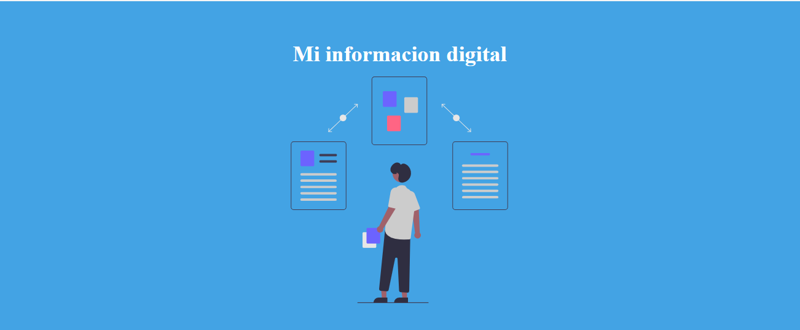
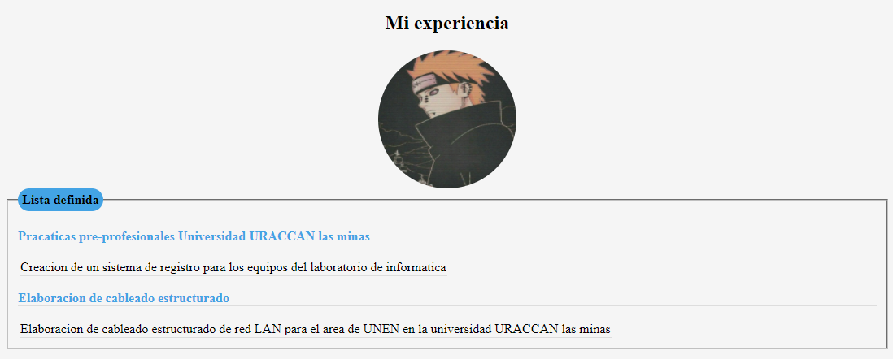
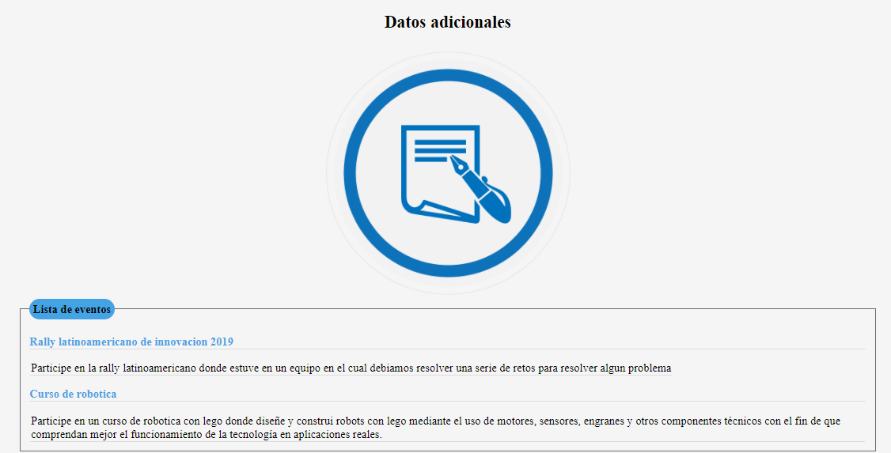
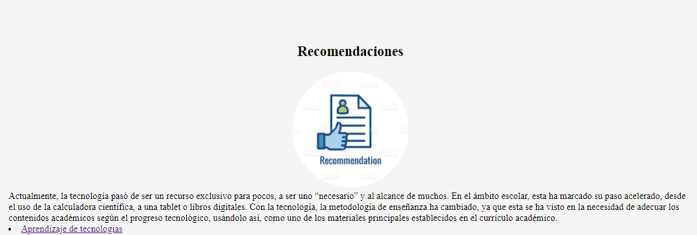
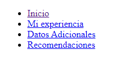
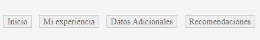

# Proceso y resultado de la contruccion del portafolio web

## Incicaciones
* Una cabecera con un encabezado, eslogan e imagen

**Cabecera**
para crear una cabecera a nuestra pagina debemos introducir dentro de la etiqueta ```<head></head>``` una etiqueta ```<h1></h1>``` dentro de esa etiqueta escribimos informacion que nosotros deseamos.

ingresamos la etiqueta ``` src="" alt=""``` para agregar una imagen que nos puede servir de logo de nuestra pagina

**Ejemplo**
```
<header id="header1">
    <h1 id="">Mi informacion digital</h1>
    
</header>
```
Asi se ve el texto y la imagen agregada



* Un apartado de experiencia con un encabezado, su foto, encabezado y una tabla con su experiencia construida en su vida

    Para crear este encabezado es igual que el anterior junto con la foto solo ponemos las etiquetas ```<h1></h1>``` con la informacion y la etiqueta `````` e introducimos la ruta de la imagen que queramos mostrar
    y para la tabla con la etiqueta ```<table></table>``` dentro de ella escribimos las demas etiquetas que nos permiten construir la tabla como sus filas y columnas las cuales son ```<tr></tr> y <td></td>```, agreue etiquetas de parrafo para hacerlas en forma de lista.

**Ejemplo**
```
<table>
<p> Pracaticas pre-profesionales Universidad URACCAN las minas</p>
    <tr>
        <td>Creacion de un sistema de registro para los equipos del laboratorio de informatica</td>
    </tr>
<p>Elaboracion de cableado estructurado</p> 
    <tr>
        <td> Elaboracion de cableado estructurado de red LAN para el area de UNEN en la universidad URACCAN las minas</td>
    </tr>
</table>
```
**Asi se veria la tabla** 

Como yo tengo agregados estilos css la tabla ya se ve con mas forma



* Un apartado de eventos con datos adicionales de compartir en eventos, presente una lista

Para crear el apartado de **datos adicionales** hacemos el mismo procedimiento en el que se creo el apartado de experiencia.

Usamos las mismas etiquetas ```<h1></h1>``` con la informacion y la etiqueta `````` e introducimos la ruta de la imagen que queramos mostrar
    y para la tabla con la etiqueta ```<table></table>``` dentro de ella volvemos a escribir las demas etiquetas que nos permiten construir la tabla ```<tr></tr> y <td></td>```

**Ejemplo**
```
<table>
  <tr>
  <p>Rally latinoamericano de innovacion 2019</p>
    <td>
    Participe en la rally latinoamericano donde estuve en un equipo en el cual debiamos resolver una serie de retos para resolver algun problema
    </td>
  </tr>
  <p>Curso de robotica</p>
  <tr>
    <td>
    Participe en un curso de robotica con lego donde diseñe y construi robots con lego mediante el uso de motores, sensores, engranes y otros componentes técnicos con el fin de que comprendan mejor el funcionamiento de la tecnología en aplicaciones reales.
    </td>
  </tr>
</table>
```
**Asi se veria en la pagina web**



* Un apartado de recomendaciones sobre el aprendizaje de tecnologías, aquí incluya una lista de vínculos que correspondan con los apartados, cada vez
que de clic sobre uno de ellos, lo traslade al apartado seleccionado

Para crear este apartado hacemos algunos de los pasos anteriores para el encabezado y la imagen ```<h2></h2>```,```<src="" alt=""```, para añadir la informacion sobre las tecnologias agregue un fielset para separar la informacion y luego le quite el borde.
```
 <section>
    <h2>Recomendaciones</h2>
    
<fieldset style="border: 0px;">
    Actualmente, la tecnología pasó de ser un recurso exclusivo para pocos etc...
</fieldset>
<section>
```
**Asi se veria el apartado de recomendaciones**



para crear el menu de navegacion a distintos apartados en el mismo documento lo hacemos con la etiqueta ```<nav></nav>``` para saber que es un menu de navegacion, luego usamos la etiqueta ```<ul></ul>``` para crear una lista no ordenada pero dentro de esa etiqueta usamos ```<li></li>``` para agregar un item de forma ordenada y por ultimo una etiqueta ```<a href="#">Titulo</a></li>``` para agregar el vinculo a una parte del documento.

Para referenciar una parte del documento agregamos la etiqueta ```id=""``` dentro de otra etiqueta t le ponemos el nombre el cual se convertira en el vinvulo por ejemplo una etiqueta ```<h1 id="vinculo">informacion1</h1>``` y ese nombre lo ponemos en la etiqueta ```<a href="#vinculo">Titulo</a></li>``` el nombre va despues del simbolo ```#```

**Ejemplo**
```
<nav id="nav">
   <ul id="navegador ul">
   <li id="navegador li"><a href="#">Inicio</a></li>
   <li id="navegador li"><a href="#0002">Mi experiencia</a></li>
   <li id="navegador li"><a href="#0003">Datos Adicionales</a></li>
   <li id="navegador li"><a href="#0004">Recomendaciones</a></li>
</ul>
</nav>
```
**Asi se veria**



como yo agregue estilos css se ve asi



* Al final debe incluir un apartado de pie de página

Para agregar un pie de pagina donde va informacion sobre el sitio, derechos de autor y las redes sociales se define con la etiqueta ```<footer></footer>``` ponemos una etiqueta de lista desordenada ```<li>Informacion de contacto: <br> tonynavas777@gmail.com</li>``` y los derechos de autor ```<p>Todos los derechos reservados © Geronimo Navas 2020</p>```

**Ejemplo**

```
<footer id="footer">
<ul>
    <li>
    Informacion de contacto: <br> tonynavas777@gmail.com
    </li>
    <a id="face" href="https://www.facebook.com/TonyNavas27"></a> <br>
    <br>
    <p>Todos los derechos reservados © Geronimo Navas 2020</p>
</ul>
</footer>
```
**Asi se veria el pie de pagina**


## Estilos css que utilice.
```
*
{
    margin: 0%;
    padding: 0%;
}
html 
{
min-height: 100%;
position: relative;
}   
#footer 
{
position: absolute;
left: 0;
right: 0;
bottom: 0;
width: 100%;
background-color: black;
color: white;
text-align: center;
}
div
{
background-color:whitesmoke;
border: 0px black solid;
padding: 10px;
width: 85%;
margin: 0 auto;
}
#foto
{
border-radius: 50%;
margin-bottom: 12px;
margin-right: 30px;
width: 170px;
height: 170px;
display: block;
margin: auto;
}
#fotoencabesado
{
    display: block;
    margin: auto;  
}
#header1 
{
padding: 50px;
text-align: center;
background: #43a3e4;
color: white;
font-size: 30px;
margin: 0px;
font-size: 18px;
line-height: 25px;
}
h2{
    text-align: center;
}
p
{
    color: #43a3e4;
    font-weight: bold;
    border-bottom: 1px solid #ddd;
}
th, td {
    border-bottom: 1px solid #ddd;
  }
  fieldset
  {
      width: 80%;
      display: block;
      margin: auto;
      margin-bottom: 10px;  
  }
#DatosAdicionales
{
display: block;
 margin: auto;
}
#recomendacion
{
    border-radius: 50%;
    margin-bottom: 12px;
    margin-right: 30px;
    width: 200px;
    height: 200px;
    display: block;
    margin: auto;
}
legend
{
    background-color:#43a3e4;
padding: 5px;
border-radius: 20px;
font-weight: bold;
}
#navegador ul
{
list-style-type: none;
text-align: center;
}
#navegador li{
display: inline;
text-align: center;
margin: 0 10px 0 0;
}
#navegador li a 
{
padding: 2px 7px 2px 7px;
color: #666;
background-color:#eeeeee;
border: 1px solid #ccc;
text-decoration: none;
}
body
{
    background-image: url("../img/body3.webp");
}
```